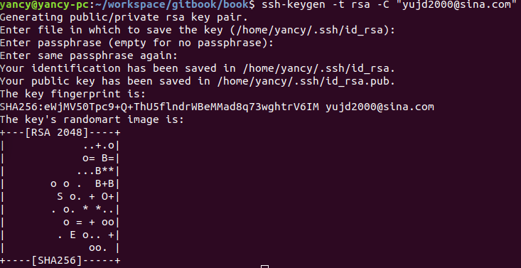
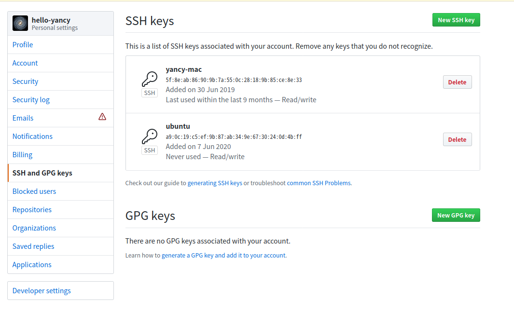

# 1. Linux 下安装 Git

## 1.1 下载并安装
Ubuntu 18.04系统，使用如下命令安装 Git

```bash
$ sudo apt-get install git
```

如果出现以下提示：

```bash
yancy@yancy-pc:~/workspace/gitbook$ sudo apt-get install git
正在读取软件包列表... 完成
正在分析软件包的依赖关系树       
正在读取状态信息... 完成       
有一些软件包无法被安装。如果您用的是 unstable 发行版，这也许是
因为系统无法达到您要求的状态造成的。该版本中可能会有一些您需要的软件
包尚未被创建或是它们已被从新到(Incoming)目录移出。
下列信息可能会对解决问题有所帮助：

下列软件包有未满足的依赖关系：
 git : 依赖: liberror-perl 但无法安装它
E: 无法修正错误，因为您要求某些软件包保持现状，就是它们破坏了软件包间的依赖关系。
```

需要更新软件包，然后再安装 Git

```bash
$ sudo apt-get update 
$ sudo apt-get upgrade

$ sudo apt-get install git
```

## 1.2 验证安装结果
使用`git --version`命令，验证安装是否成功，示例如下：
```bash
$ git --version
git version 2.17.1
```

# 2. Windows 下安装 Git

## 2.1 下载并安装
从[Node.js](https://nodejs.org/en/)的官网，下载安装包node-v10.16.0-x64.msi，双击并安装

注：验证方法参考Linux下的方法

# 3. 配置 Git

## 3.1 用户信息

配置个人的用户名称和电子邮件地址：

```bash
$ git config --global user.name "hello-yancy"
$ git config --global user.email "yujd2000@sina.com"
```

查看配置结果
```bash
$ git config --list
user.name=hello-yancy
user.email=yujd2000@sina.com
```

## 3.2 SSH Key

使用如下命令生成密钥：

```
$ ssh-keygen -t rsa -C "yujd2000@sina.com"
```

 截图如下：


在  `~/.ssh` 目录下会生成以下两个文件：

```bash
id_rsa
id_rsa.pub
```

打开 github  > Setting > SSH and GPG keys 页面


新建一个 `New SSH Key`,   并将 `~/.ssh/id_rsa.pub` 文件中的内容粘贴进去，完成后截图如下：



# 4. 参考

[1] [git ssh key配置](https://blog.csdn.net/lqlqlq007/article/details/78983879)